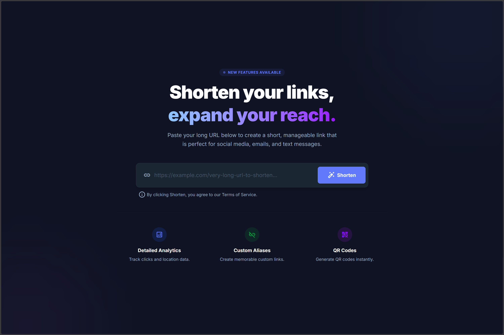
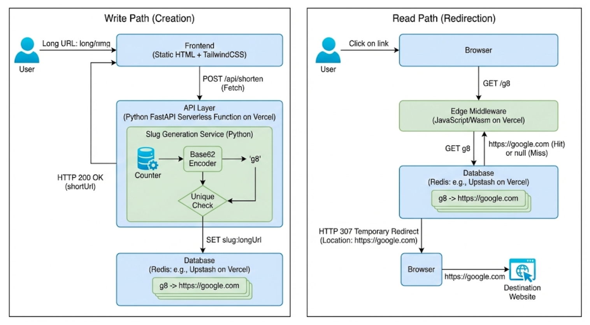

<div align=center>
  <h2 style="font-family: 'Arial'">Shortify: Shorten your link, expand your reach</h2>
  

</div>

#### A modern, serverless URL shortener built with **Vercel**, **Upstash Redis**, and **FastAPI**. Features instant redirects via Edge Middleware and a beautiful TailwindCSS frontend.

## Architecture overview

This application follows a **two-path architecture** optimized for speed and scalability:



### Why This Architecture?

| Component           | Technology                | Why?                                                             |
| ------------------- | ------------------------- | ---------------------------------------------------------------- |
| **Frontend**        | Static HTML + TailwindCSS | Fast CDN delivery, no server needed                              |
| **API Layer**       | Python FastAPI on Vercel  | Serverless, scales to zero, easy Redis integration               |
| **Slug Generation** | Counter + Base62          | Short slugs (e.g., `g8`), guaranteed unique via atomic increment |
| **Database**        | Upstash Redis             | Serverless Redis with REST API, <1ms latency                     |
| **Redirects**       | Vercel Edge Middleware    | Runs at CDN edge (~50ms globally), no cold starts                |

---

## Project Structure

```
shortify/
├── index.html              # Frontend UI (Static HTML & TailwindCSS)
├── vercel.json             # Vercel deployment configuration
├── package.json            # Node.js dependencies
├── requirements.txt        # Python dependencies
├── .env.example            # Environment variables template
│
├── api/
│   └── shorten.py          # FastAPI endpoint for URL creation
    └── redirect.ts
│
└── src/
    ├── input.css           # TailwindCSS source
    └── output.css          # Compiled CSS
```

## Tech Stack
<p align="left">
  
</p>

## Getting Started

### Prerequisites

- **[Bun](https://bun.sh/) or Node.js 18+**
- **[Vercel CLI](https://vercel.com/cli) (optional for local dev)**
- **[Upstash Redis](https://upstash.com/) account (free tier available)**

### 1. Clone & Install

```bash
git clone https://github.com/yourusername/shortify.git
cd shortify
bun install
```

### 2. Set Up Environment Variables

Create a `.env.local` file:

```env
UPSTASH_REDIS_REST_URL=https://your-redis-url.upstash.io
UPSTASH_REDIS_REST_TOKEN=your-token-here
```

### 3. Run Locally

```bash
# Start TailwindCSS watcher
bun run dev

# In another terminal, start Vercel dev server
vercel dev
```

### 4. Deploy to Vercel

```bash
vercel --prod
```

## API Reference

### Create Short URL

```http
POST /api/shorten
Content-Type: application/json

{
  "url": "https://example.com/very/long/url"
}
```

**Response:**

```json
{
  "shortUrl": "https://short.ly/g8",
  "slug": "g8",
  "originalUrl": "https://example.com/very/long/url"
}
```

### Redirect (via Edge Middleware)

```http
GET /:slug
```

**Response:** `HTTP 307 Temporary Redirect` with `Location` header

## Environment Variables needed (set these up locally)

| Variable                   | Description                        |
| -------------------------- | ---------------------------------- |
| `UPSTASH_REDIS_REST_URL`   | Upstash Redis REST API URL         |
| `UPSTASH_REDIS_REST_TOKEN` | Upstash Redis authentication token |

## License

MIT License — feel free to use this project for learning or production.
